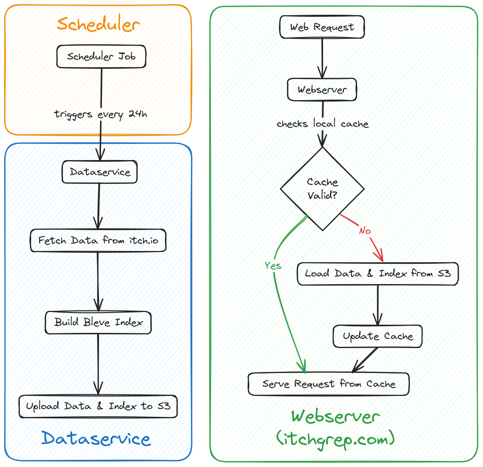

<!-- LTeX: language=en-US -->

<div align="center">

# itchgrep.com

### _Discover the Perfect Assets for Your Games_

🔍 search through itch.io assets using text queries; find what you need without relying solely on tags.

🌐 Visit [itchgrep.com](https://itchgrep.com/) to start exploring.

</div>

<div align="left">

### 🤝 Join Our Community
We have a [🎮 Discord server](https://discord.gg/f8nyyK4ngZ)! It's a place for sharing, learning, and talking about game development and the projects we're passionate about. Feel free to join us!

### 💖 Support itchgrep

Your support fuels our passion and helps keep the servers running! If you appreciate what we do and want to contribute to our journey, consider:

- 🍵 [**Buying me a coffee!** Your generosity is immensely appreciated, and every cup allows me to keep working on cool stuff.](https://www.buymeacoffee.com/winterv)

</div>

## 🛠 Techstack

- **[Go](https://go.dev/)**
- **[Templ](https://github.com/a-h/templ)**
- **[Bleve](https://github.com/blevesearch/bleve)**
- **[HTMX](https://htmx.org/)**
- **[Google Cloud](https://cloud.google.com/?hl=en)**:
- **[Docker](https://www.docker.com/)**

These tools and technologies were chosen with care to provide a seamless and efficient experience for both developers and users of itchgrep.

## 🗼 Architecture


## Running Locally

If you want to [contribute](#contributing), or just run the project locally for your own use,
follow the instructions below.

> This project is built and maintained on Linux. While I don't think it's
> generally impossible to run on Windows, but the
> [Taskfile](https://taskfile.dev/) is written using Linux commands.

### Tooling Dependencies
- [Golang](https://go.dev/)
- [Task](https://taskfile.dev/)
- [Docker](https://www.docker.com/)
- [gcloud](https://cloud.google.com/sdk/gcloud)

### Running
The project is split up into two services:
- The `dataservice`, responsible for fetching the list of assets from [itch.io](https://itch.io/)
- The `webserver`, presenting the stored data with search tools.

Use the included [Taskfile](https://taskfile.dev/) to run these services.
> - `task local-dataservice` will launch the `dataservice` with a local instance
>     of GCS. Send a `GET` request to its trigger endpoint: 
>     `curl -X GET "localhost:8080/trigger-fetch"`.
>     This will cause the service to scrape the data from itch.io, index it and
>     store both data and index on the local GCS.
- !! The way of running described above is currently not working properly, I am
    looking for assistance on this. Please see [Issue #1](https://github.com/wintermute-cell/itchgrep/issues/1).
    In the meantime use `task local-dataservice-temp-fix`. This runs the
    `dataservice` without docker.
- `task local-webserver` will build and run the web server in a Docker
    container together with the local GCS in a separate container. `Templ`
    templates are not copied during the build, but generated inside the
    container.
- `task templ` will generate `.go` files from any `.templ` files. This is not
    required for building/running, but to provide code completion and stop the
    language server from complaining.

## Deploying in the Cloud
The project was created with the intention of hosting both `dataservice` and
`webserver` on Google Cloud Run. The asset data is intended to be stored in
Google Cloud Store.

> Google Cloud Run can be replaced with any serverless platform, and Google
> Cloud Store can be replaced with any object store, but some work will be
> required if this is your goal, and the following instructions will assume
> Google Cloud services.

To deploy the project on Google Cloud, follow the steps below.

### Setting up `gcloud`
A couple of preparation steps:
- Make sure, you have set up a project in your [Google Cloud Console](https://console.cloud.google.com).
- In your project, create an object store with the name `itchgrep-data`. (You
    can also use another name here, but you must then change the `const` in the
    file `internal/storage/storage.go` accordingly)
- In your project, create a new [service account](https://console.cloud.google.com/iam-admin/serviceaccounts), and give
    it the role of `Cloud Run Invoker`. Later, we will attach this service account
    to a scheduler job, to regularly trigger a run of the dataservice.
- Make sure you have installed the [gcloud CLI](https://cloud.google.com/sdk/gcloud).
- You may use `task gcloud-setup` to configure `gcloud` for use with this
    project. Otherwise, make sure to properly configure manually.
- Adjust all instances of the variables `PROJECT_ID`, `REGION` and `LOCATION`
    found in the `Taskfile` to fit your Google Cloud project configuration.

### Deploying the dataservice and setting up a Scheduler Job
- Run `task deploy-dataservice` to build and deploy the dataservice. At the end
    you will receive a service URL for the newly deployed dataservice.
- Now, to create a scheduler job, run the following command. Notice how we are
    passing security critical information as environment variables:
    ```bash
    DATASERVICE_URL=https://dataservice-ly6n5ozylq-od.a.run.app \
    SERVICE_ACCOUNT_EMAIL=cloud-run-invoker@itchgrep.iam.gserviceaccount.com \
    go-task create-dataservice-scheduler-job
    ```
- At this point, you should manually force a run of the dataservice-job in the
    [cloud scheduler console](https://console.cloud.google.com/cloudscheduler).
    This will ensure that the object store is populated with data, before we
    start the webserver for the first time. You should wait around 5 minutes
    after doing that, before deploying the webserver, so the dataservice has
    time to fetch and store new data.

### Deploying the webserver
Run `task deploy-webserver`. No further work should be required.

## Testing
Tests can be run by using the included [Taskfile](https://taskfile.dev/).

- `task test`: Runs all of the test tasks below.
- `task test-storage`: Tests the `storage` package, requires `Docker` to be running.

## Contributing
- before posting a pull request, please use [`go fmt`](https://go.dev/blog/gofmt) to format your code.
- beginners to open source are welcome. if you'd like to contribute, but don't
    understand something, you're welcome to ask using an issue.
- please post feature requests as one issue per feature.
- before working on a larger contribution, please open an issue to ask if the
    feature you want to implement would be welcome.
- to maintain a transparent workflow, please keep all discourse regarding work
    on this repository in the github issues, don't message me through other
    channels to discuss this.
